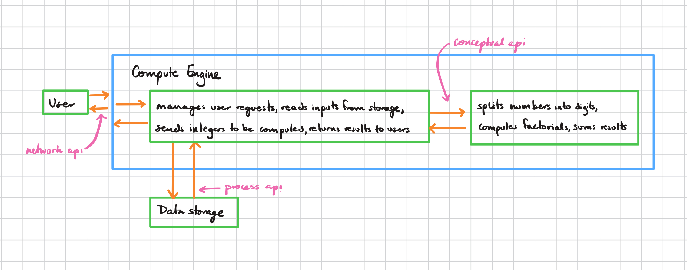

# Software Engineering Project Starter Code

**Checkpoint 2: Drafting an API**
- Part 1: System computation: sum of the factorials of each digit
- Part 2: System Design Diagram:

**Checkpoint 8: Performance Benchmarks **

### 1. Factorial Bottleneck Benchmark (Compute Engine)
 
 	**Purpose:** Measure CPU-intensive sum-of-digit-factorial computations
 	
 	**Method:** Large numbers, multiple iterations, jvm warm-up
 	
 	**Non-optimized**
 	last result: 63
 	execution time (ms): 112
 	
 	**Optimized**
 	last result: 63
 	execution time (ms): 58
 	
 	**Improved:** ~47% faster
 	
### 2. Coordinator / Pipeline Benchmark
 
 	**Purpose:** Measure end-to-end pipeline performance (input → compute → output)
 	
 	**Method:** Large dataset (200,000 numbers), in-memory storage, original vs optimized compute engine
 	
 	**Non-optimized**
 	last result: 63
 	execution time (ms): 112
 	
 	**Optimized**
 	last result: 112,000,000
 	
 	**Improved:**  47.3% faster
 	execution time (ms): 59,000,000